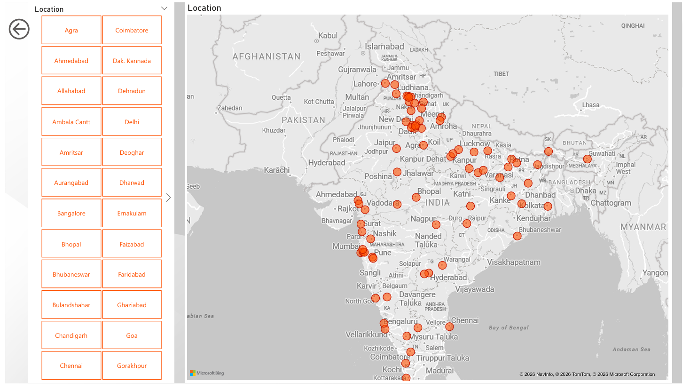

# 🚗 AutoIntelligence: Car Dekho Market Analytics Dashboard


## 📊 Project Overview

An interactive Power BI dashboard providing comprehensive analytics and strategic insights into Car Dekho's used car market ecosystem. This dashboard analyzes **2,059 pre-owned vehicles** across India, delivering actionable intelligence on pricing trends, depreciation patterns, brand performance, and market segmentation.

### 🎯 Business Objectives

- Identify key value drivers in the Indian used-car market
- Analyze vehicle depreciation trends across different segments
- Segment inventory by brand tier and usage metrics
- Enable data-driven decision making for inventory optimization

---

## 📈 Key Performance Indicators (KPIs)

| Metric | Value |
|--------|-------|
| **Total Inventory** | 2,059 Units |
| **Average Listing Price** | ₹17.03 Lakhs |
| **Median Listing Price** | ₹8.25 Lakhs |
| **Average Vehicle Age** | 9.6 Years |
| **Market Leader** | Maruti Suzuki |
| **Most Expensive Car** | Ferrari 488 GTB (₹35M) |
| **Most Affordable Car** | Tata Nano Base (₹49K) |

---

## 🎨 Dashboard Features

### 1️⃣ **Overview Dashboard**
- Real-time inventory metrics
- Vehicle category distribution (Hatchback, Sedan, SUV, MUV)
- Brand-wise car volume analysis
- Price range categorization

### 2️⃣ **Geographic Distribution**
- Interactive map visualization across 50+ Indian cities
- Location-based inventory insights
- Regional market trends

### 3️⃣ **Price Analysis**
- Donut chart showing revenue distribution by brand
- Price segmentation categories:
  - ₹50K - ₹1L: 2 vehicles
  - ₹5L - ₹10L: 631 vehicles
  - ₹20L - ₹40L: 272 vehicles
  - ₹40L - ₹80L: 176 vehicles
  - Above ₹1Cr: 22 vehicles

### 4️⃣ **Vehicle Details Explorer**
- Filterable car specifications
- Model-wise comparison
- Fuel type, transmission, and engine analysis

---

## 🔍 Key Insights & Findings

### Market Segmentation
- **Volume Segment**: Maruti Suzuki and Hyundai dominate with focus on fuel efficiency and manual transmissions
- **Luxury Segment**: Mercedes-Benz, BMW, Audi command premium pricing with automatic transmissions

### Depreciation Trends
- Sharp exponential decay in first 5-7 years
- Vehicles older than 12 years reach a "price floor"
- Luxury brands (Mercedes/BMW) retain value better

### Fuel & Transmission Insights
- Diesel remains dominant for SUVs/MUVs
- Automatic transmission correlates with higher price points (₹15L+)
- Clear bifurcation between mass market and premium segments

### Ownership Premium
- First-owner vehicles command 15-20% premium
- Significant value differentiator in resale market

---

## 🛠️ Technologies Used

- **Power BI Desktop** - Dashboard creation and visualization
- **DAX** - Data modeling and calculations
- **Microsoft Excel** - Data preprocessing
- **Power Query** - Data transformation

---

## 📂 Repository Structure

```
Car-Dekho-Dashboard/
│
├── README.md                          # Project documentation
├── dashboard/
│   ├── Car_Dekho_Dashboard.pdf        # Dashboard export (PDF)
│   └── screenshots/                   # Dashboard screenshots
├── reports/
│   └── Analysis_Report.pdf            # Detailed analysis document
├── dataset/
│   └── sample_data.xlsx              # Sample dataset
└── images/
    └── dashboard_preview.png          # Preview images
```

---

## 📊 Dashboard Pages

1. **Home Dashboard** - Overview metrics and KPIs
2. **Geographic Analysis** - Location-based distribution
3. **Price Categories** - Detailed price segmentation
4. **Vehicle Explorer** - Filterable car details

---

## 🚀 Strategic Recommendations

### 1. Inventory Optimization
Focus on acquiring **4-6 year old "First Owner" SUVs** - the sweet spot where depreciation has slowed but vehicles remain modern.

### 2. Regional Strategy
- **Metro Markets** (Delhi, Mumbai): Higher luxury car turnover
- **Tier-2 Cities** (Bangalore): Focus on fuel-efficient hatchbacks

### 3. Digital Transformation
Identify "Quick-Flip" opportunities using kilometer vs. price outlier analysis for high-profit margins.

### 4. Premium Positioning
Implement "Certified Premium" designation for first-owner vehicles to justify higher margins.

---

## 📸 Dashboard Preview





---

## 📥 How to Use

### View Dashboard (PDF)
1. Navigate to `dashboard/Car_Dekho_Dashboard.pdf`
2. Open with any PDF reader


---

## 📊 Data Summary

- **Total Records**: 2,059 vehicles
- **Data Points**: 15+ attributes per vehicle
- **Geographic Coverage**: 50+ Indian cities
- **Brand Coverage**: 14+ automotive manufacturers
- **Price Range**: ₹49K to ₹35M

---

## 🎓 Learning Outcomes

This project demonstrates:
- Advanced Power BI visualization techniques
- DAX measure creation and calculated columns
- Geographic data visualization
- Business intelligence storytelling
- Market segmentation analysis
- Depreciation modeling

---

## 🤝 Connect With Me

- **LinkedIn**: (https://www.linkedin.com/in/priyanshu-singh-b597ba37b/)
- **Portfolio**: [Your Portfolio Website]
- **Email**: priyanshuav7725@gmail.com

---

## 🙏 Acknowledgments

- Data Source: Car Dekho
- Tools: Microsoft Power BI, Excel
- Inspiration: Real-world automotive market analytics

---
